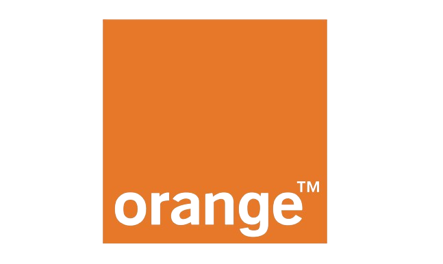

# Borne Metahuman

Ce projet est réalisé dans le cadre de notre deuxième année de cycle ingénieur à Télécom Saint-Étienne (FISE2). Il s'inscrit dans le module Projet PING, qui met en lien les étudiants avec les entreprises pendant une période de 4 semaines environ. L'objectif est de permettre aux étudiants de travailler sur des projets réels proposés par des entreprises partenaires, afin de développer leurs compétences techniques et professionnelles dans un environnement concret.

<p align="center">
  
</p>


## Description

Le projet Ping Orange vise à développer une borne interactive innovante pour les magasins de l'opérateur téléphonique Orange. Cette borne est conçue pour accueillir et assister les clients de manière intuitive et efficace grâce à un personnage virtuel sophistiqué, appelé Metahuman.

### Contexte et Objectif

L'objectif principal du projet est d'améliorer l'expérience client en magasin en intégrant des technologies avancées de modélisation 3D et d'intelligence artificielle (IA). La borne interactive permet aux clients d'interagir avec un Metahuman, un avatar réaliste créé avec Metahuman Creator et animé dans Unreal Engine 5, proposés par Epic Games. Ce métahuman a la capacité de comprendre les demandes des clients et de répondre de manière appropriée, offrant ainsi un service personnalisé et engageant.

### Fonctionnalités Clés

1. **Accueil des Clients** :
    - Le Metahuman accueille les clients dès leur arrivée à la borne, créant une première impression chaleureuse et professionnelle.
    - Grâce à une interface conviviale, les clients peuvent poser des questions ou formuler des demandes spécifiques en utilisant des commandes vocales ou textuelles.

2. **Compréhension des Demandes** :
    - Une intelligence artificielle sophistiquée est intégrée pour analyser et comprendre les demandes des clients.
    - Les demandes sont classifiées en différentes catégories telles que "Achat", "Rendez-vous" et "Autres" à l'aide d'un modèle de traitement du langage naturel (NLP).

3. **Exécution de Scénarios** :
    - En fonction de la classification des demandes, différents scénarios sont exécutés dans Unreal Engine 5.
    - Le métahuman guide les clients à travers des processus spécifiques, par exemple, prendre un rendez-vous ou fournir des informations sur les produits.

### Technologies Utilisées
- **Metahuman Creator** :
    - Utilisé pour créer notre personnage Hadley qui est un Metahuman extrêmement réaliste. Metahuman Creator permet de concevoir des avatars avec des détails très fins, ce qui est essentiel pour offrir une interaction réaliste et engageante aux clients.
- **Nvidia Omniverse** :
    - Utilisé pour intégrer les mouvements de syntaxes labiales au métahuman, permettant des animations faciales plus naturelles et synchronisées avec le discours. Omniverse améliore la fidélité et le réalisme des interactions vocales en assurant que les mouvements des lèvres du Metahuman correspondent précisément aux sons produits lors des scénarios.
- **Unreal Engine 5** :
    - Utilisé pour intégrer le Metahuman dans la scène et gérer les scénarios d'interaction. Unreal Engine permet de créer des personnages et des environnements 3D réalistes et interactifs.
- **Pixel Streaming** :
    - Permet de diffuser le contenu Unreal Engine directement dans un navigateur web. Cette technologie utilise le WebRTC pour une communication en temps réel et une interaction fluide.
- **Intelligence Artificielle (IA)** :
    - Un modèle d'IA basé sur PyTorch et Spacy est utilisé pour analyser les demandes des clients et les classer en catégories pertinentes.
    - Le modèle est déployé via une API Flask, qui peut être exécutée localement ou dans le cloud.


## Structure du Projet

Le projet est organisé en trois répertoires principaux :

- **UnrealEngine** :
    - Ce répertoire contient le projet Unreal Engine 5 avec le métahuman et les scénarios d'interaction.
- **IA** :
    - Contient le modèle d'IA et l'API Flask pour traiter les demandes des clients.
    - **Cloud** : Contient une solution basée sur le cloud avec une image Docker à télécharger et exécuter.
    - **Local** : Contient une solution locale pour exécuter l'IA sur une machine locale.
- **PixelStreaming** :
    - Contient les scripts nécessaires pour configurer et lancer le pixel streaming, permettant de diffuser le contenu Unreal Engine dans un navigateur web.

## Prérequis

Avant de lancer le projet, assurez-vous d'avoir les éléments suivants installés :

- **Unreal Engine 5.3**
- **Node.js**
- **VisualStudio2020**
- **Docker**
- **PixelStreaming Plugin**
- **Python 3.11**
- **Flask**
- **PyTorch**
- **Spacy avec le modèle français (`fr_core_news_sm`)**
- **Navigateur web compatible WebRTC**

## Installation

1. **Cloner le dépôt** :
    ```bash
    git clone https://github.com/urrickane/Projet_Ping_Orange.git
    cd Projet_Ping_Orange
    ```

2. **Configurer l'environnement Python et Lancer l'API Flask** :
    - Pour exécuter la solution Cloud, naviguez dans le sous-dossier `IA/Cloud` et exécutez le script :
        ```bash
        cd IA/Cloud
        ./start_cloud_server.sh
        ```
    - Pour exécuter la solution locale, naviguez dans le sous-dossier `IA/Local` et exécutez le script :
        ```bash
        cd IA/Local
        ./start_local_server.sh
        ```

4. **Ouvrir le projet Unreal Engine** :
    - Ouvrez Unreal Engine 5 et chargez le projet dans le répertoire `UnrealEngine`.

5. **Démarrer le Pixel Streaming** :
    - Suivez les instructions dans le répertoire `PixelStreaming` pour démarrer le pixel streaming.

## Contributeurs

- Ewan Sauze
- Jibril Otmani
- Sophie Trouillot
- Corentin Laval

## License

Ce projet est sous licence libre.
